# Kiln Controller

Tamir's web-based electric kiln controller for the **Orange Pi Zero 2W**: live temperature control,
editable programs, durable firing history, electricity cost estimates, and browser-based settings.

[Hardware](#hardware) · [Installation](#installation) · [Dashboard](#dashboard-and-programs) · [Firing history](#firing-history) ·
[Settings](#settings) · [Recovery](#control-and-power-loss-recovery) · [API](#api-and-diagnostics) ·
[Backups](#data-backups-and-updates)

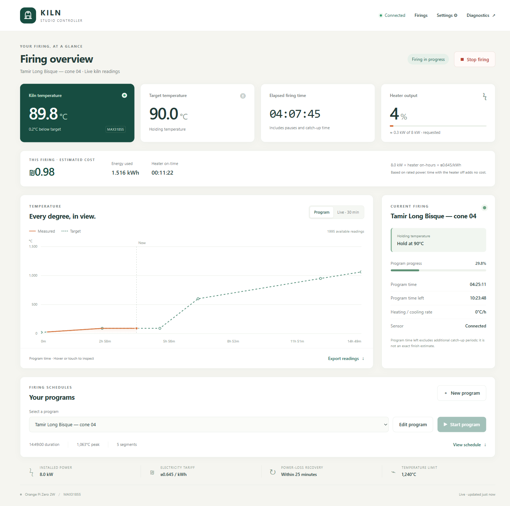

Screenshots were captured from the real running controller on **4 October 2026**. Readings change during
a firing, and this installation's local configuration differs from the repository defaults.

## Hardware

The [illustrated hardware guide](docs/HARDWARE.md) explains controller power,
sensor wiring, the relay/SSR connection, and a three-phase kiln's power path.
It includes the supplied SSR reference: **3–32 VDC control input, up to 40 mA**.
The relay switches a 5 V control supply into that input; kiln mains use the
separate SSR power terminals.

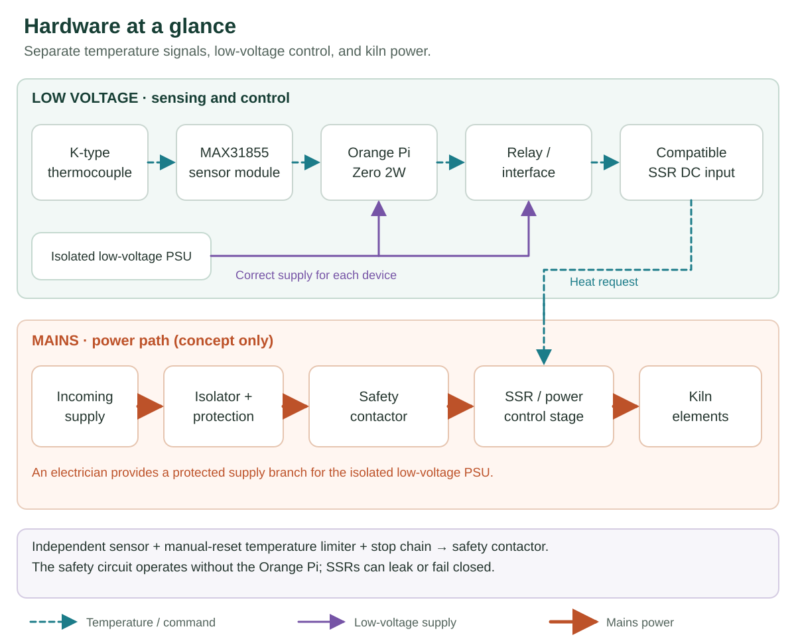

| Start here | What the guide shows |
| --- | --- |
| [Controller power](docs/HARDWARE.md#2-power-the-controller) | 5 V board power, 3.3 V logic, and relay supply requirements |
| [Sensor & wiring](docs/HARDWARE.md#3-connect-the-temperature-sensor) | MAX31855 connections by physical Orange Pi pin number |
| [Relay & SSR](docs/HARDWARE.md#4-connect-the-relay-and-ssr-input) | Active-low heat request, COM/NO contacts, and DC input polarity |
| [Three-phase kiln](docs/HARDWARE.md#5-understand-the-three-phase-power-path) | Isolation, protection, independent cutoff, contactor, SSR, and protective earth |

The mains drawing is a conceptual arrangement for a qualified electrician.
Actual supply voltage, element connections, and protective-device ratings must
come from the kiln's nameplate and installation design.

## Installation

**Follow the [hardware guide](docs/HARDWARE.md) and [Orange Pi software installation guide](docs/INSTALL.md).** The software guide covers the OS, GPIO, Python dependencies,
simulation, wiring, settings, service, commissioning, testing, backups, and updates.

> Keep kiln mains isolated while configuring and checking the output. The tracked
> defaults select **real hardware**, an **active-high output**, and a **two-second
> control cycle**. Verify the actual driver polarity before starting a controller
> or service. Use an independent over-temperature cutoff and appropriate mains
> protection; software cannot disconnect a failed-closed SSR.

The target is an Orange Pi Zero 2W running Debian 12 with Python 3.11. This fork uses its H616-compatible GPIO
mapping and Orange Pi pin choices; other boards require configuration and compatibility work.

1. Prepare Debian, install the distro GPIO bindings, and configure the `gpio`
   group, Chrony, and Avahi as described in the guide.
2. Clone [tamirgold/kiln-controller](https://github.com/tamirgold/kiln-controller)
   on the Orange Pi. The repository is private, so authenticate with GitHub first:

   ```bash
   cd /home/orangepi
   git clone git@github.com:tamirgold/kiln-controller.git
   cd kiln-controller
   ```

3. Create a virtual environment with system site packages. Follow the guide's
   dependency command, which omits Raspberry Pi's `RPi.GPIO` and uses the recorded
   working Blinka version with the distro's `gpiod` bindings.
4. Preview in simulation using a separate state file and port. This disables
   hardware heating, but imports still require the compatible Linux GPIO setup.
5. With mains isolated, verify wiring, sensor readings, output polarity, power,
   tariff, temperature limits, and PID configuration. Create local overrides.
6. Install the supplied systemd service, then commission real operation. The
   guide provides an initial simulation configuration for the documented relay.
7. Run the tests and verify idle state, fresh sensor data, and expected settings
   before starting a real firing.

The service expects `/home/orangepi/kiln-controller` and account `orangepi`; adjust it for other paths.
In a fresh clone, `config.py` and `kiln-controller.py` are at the root. Use the guide instead of `start-on-boot`.

### Open the system

These addresses work on the installation's local network. Substitute the board's IP address if `.local` name
resolution is unavailable.

| Page | Current system | Route |
| --- | --- | --- |
| Dashboard | [Firing overview](http://orangepizero2w.local:8081/picoreflow/index.html) | `/picoreflow/index.html` |
| History | [Firing records](http://orangepizero2w.local:8081/picoreflow/history.html) | `/picoreflow/history.html` |
| Settings | [Controller settings](http://orangepizero2w.local:8081/picoreflow/settings.html) | `/picoreflow/settings.html` |
| Diagnostics | [PID diagnostics](http://orangepizero2w.local:8081/state) | `/state` |

The root URL redirects to the dashboard. The HTTP server has no user login or TLS; keep it on a trusted local
network and do not expose its port directly to the Internet.

### Source defaults and photographed installation

`config.py` supplies defaults; local `settings.json` overrides them. The values
below were checked against the running system on 4 October 2026.

| Setting | Tracked default | Current installation |
| --- | --- | --- |
| Operating mode | Real hardware | Real hardware |
| Installed heating power | 11 kW | 8 kW |
| Tariff and currency | ₪0.645/kWh | ₪0.645/kWh |
| Temperature units | Celsius | Celsius |
| Converter / thermocouple | MAX31855 / K | MAX31855 / K |
| Control cycle | 2 seconds | 30 seconds |
| Output polarity (`gpio_heat_invert`) | `false`: active high | `true`: active low |
| Automatic recovery window | 15 minutes | 25 minutes |
| Over-temperature limit | 1240°C | 1240°C |

These are installation values, not recommended settings for every kiln. The [installation
guide](docs/INSTALL.md#5-set-local-hardware-configuration) includes physical pin assignments and commissioning
checks. The dated [relay wiring record](docs/RELAY-MODULE-CHANGE.md) describes this installation's relay
module and pull-up; verify your own hardware before using that wiring.

## Dashboard and programs

- See measured and target temperature, requested heater duty, approximate kW,
  sensor status, heating/cooling rate, and the current ramp, hold, or cooling phase.
- Track elapsed firing time separately from program progress. Elapsed time includes
  pauses and catch-up; program time left is not an exact finish-time prediction.
- Compare the original schedule with measured temperatures on the same elapsed-time
  axis in **Plan vs actual**. Warm starts put the saved starting program position
  at zero and focus on actual readings and the remaining plan. A start summary
  shows the starting temperature and skipped duration. **Show skipped steps**
  reveals earlier program points at negative times; remaining steps stay positive.
  The offset stays fixed through catch-up and recovery. Comparison is unavailable
  if the original starting position is missing from the firing's saved readings.
  Switch to **Program** for program progress or **Live · 30 min** for recent readings
  and the controller's target. Inspect points with a mouse, touch, or arrow keys,
  and export available readings as CSV.
- Zoom the temperature chart with **+** and **−**, move with **Earlier**/**Later**
  or drag while zoomed, and use **Reset** to restore the full view. Ctrl+scroll
  zooms around the pointer. Zoomed views keep their time window as readings arrive;
  the temperature axis fits that window. Keyboard shortcuts on the chart: +/− to
  zoom, Shift+Left/Right to move, and 0 to reset.
- Reconnect automatically after a lost browser connection. The controller keeps
  operating; connection and sensor warnings identify unavailable readings.
- Recover the current firing's saved curve when reopening the dashboard. Live
  status updates at least every two seconds under normal operation; long browser
  curves are down-sampled while durable history retains its saved samples.

<details><summary>Current dashboard in Live · 30 min view</summary>

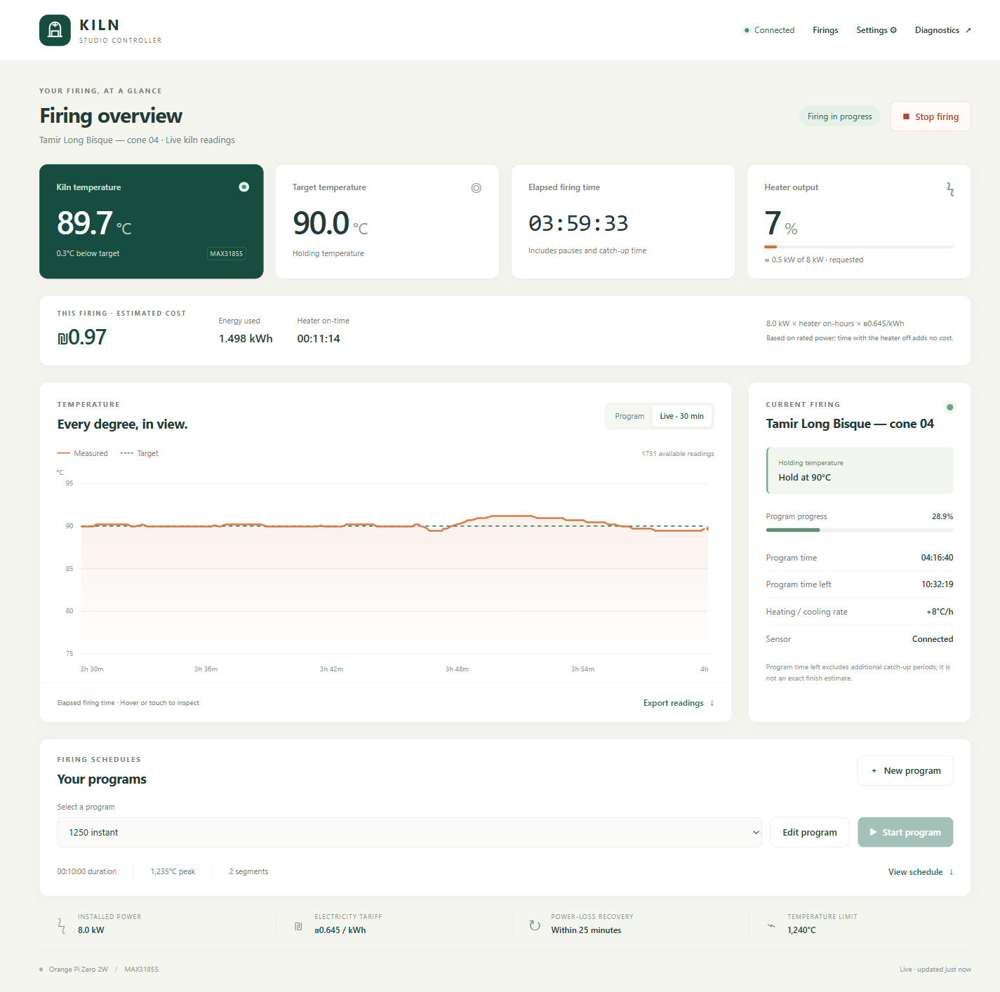

</details>

### Create and run a program

1. Choose **New program**, or select an existing program and choose **Edit program**.
2. Give it a name and enter cumulative times and target temperatures. Start at
   time zero and use increasing times; two equal temperatures create a hold.
3. Enter a ramp rate to calculate that segment's duration and shift later points.
   Heating rates are positive, cooling rates negative; set hold duration with time.
4. Review the curve, total duration, peak temperature, and schedule table, then save.
5. With a ready sensor and idle kiln, choose **Start program** and confirm the
   program, scheduled duration, and peak. **Stop firing** switches heating off
   and cancels automatic recovery of that firing; cooling is passive.

The editor supports seconds, minutes, or hours and configurable rate units. Targets cannot exceed the
configured temperature limit. Saved heating-capacity measurements warn about ambitious ramps without
preventing a save; unmeasured temperature ranges are identified separately.

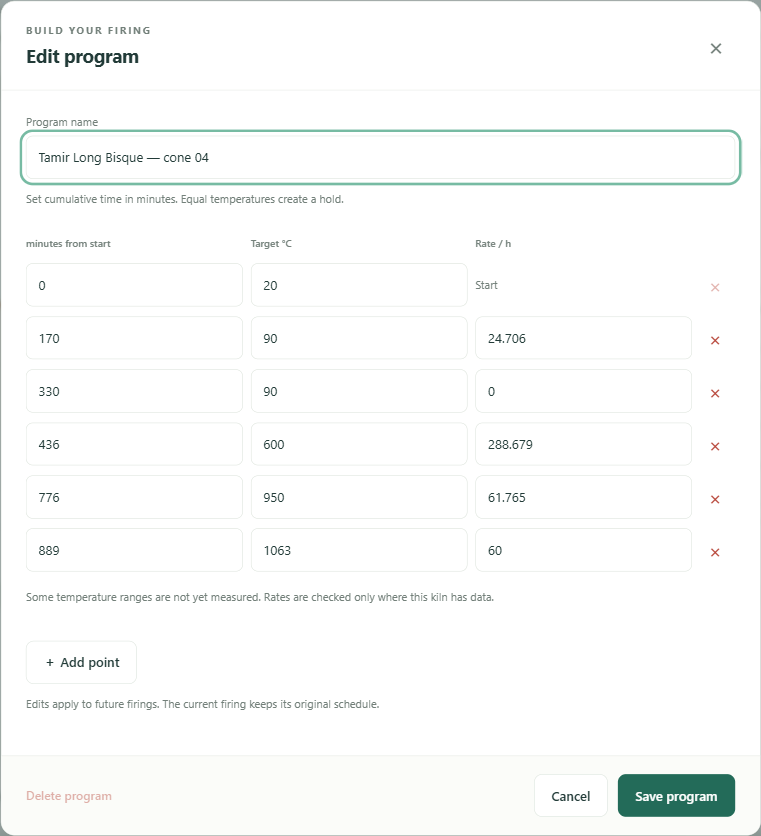

You can add and remove points, save changes, and delete unused programs. Edits to an active program apply to
future firings; the current firing keeps its original schedule. Its program cannot be deleted in the editor.
Changing a program's name saves another program, leaving the original available.

### Electricity and energy

The dashboard shows the current firing's estimated cost, energy, and heater on-time, then its final totals
when the kiln becomes idle. Accounting uses:

**Energy (kWh) = installed power (kW) × heater on-hours**

**Cost = energy × electricity tariff**

For the photographed 8 kW kiln, one hour of heater on-time costs **₪5.16** at ₪0.645/kWh. Off-time adds no
energy; an hour of elapsed firing time may include many off periods. Accounting follows actual
controller-output on-time, including a pulse in progress, and preserves totals across eligible recovery.

This is a rated-power estimate, not a mains meter. The heater percentage is the PID's requested duty, not
confirmation that relay contacts or elements are on. Partial totals and earlier values reconstructed from logs
are labeled explicitly.

## Firing history

Each firing retains its program snapshot, measured/target curve, result, duration, peak temperature, heater
on-time, energy, and cost. Records survive controller restarts; an eligible recovery continues the same firing
record.

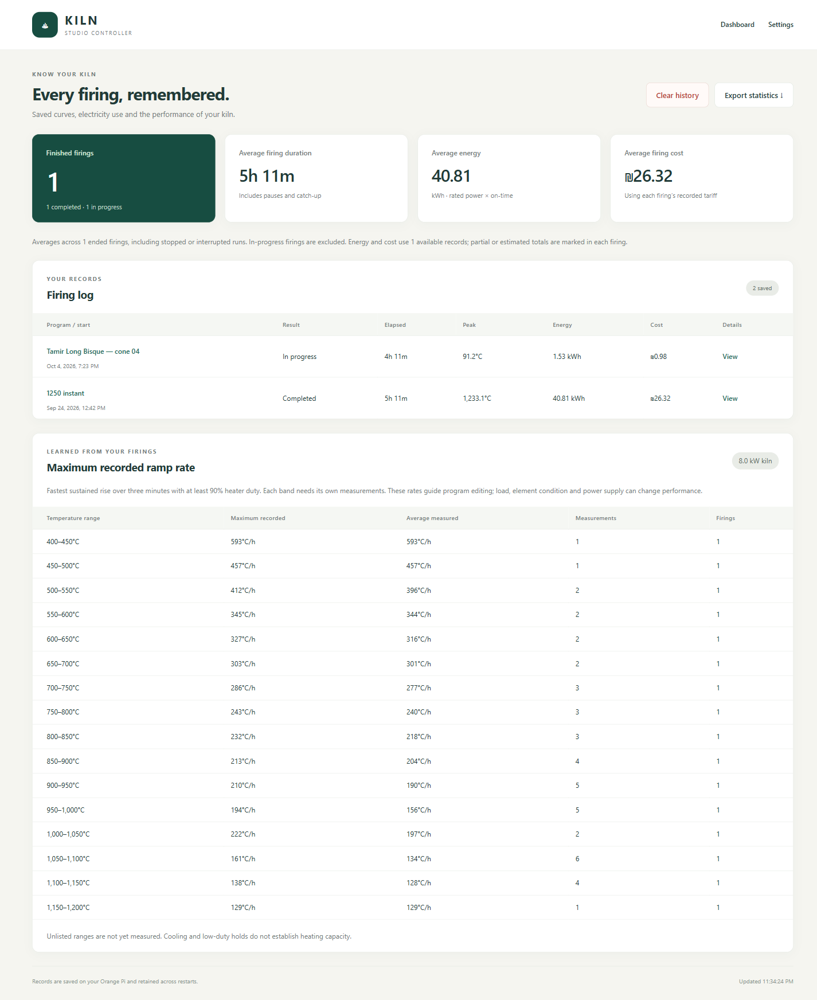

- Summary averages cover **ended firings**, including stopped and interrupted
  runs; running and paused firings are excluded. Costs keep currencies separate.
- Open a record for its curve, average temperature, average target error, catch-up
  time, sample count, and data-quality notes. Gaps remain visible and are excluded
  from temperature averages and heating-capacity measurements.
- Export the statistics overview as JSON or an individual firing as JSON or CSV.
  History CSV temperatures are stored in Celsius regardless of display units.
- **Clear history** reviews and removes ended records and recalculates statistics.
  Saved programs and running/paused firings are kept. Export records before clearing.
- Real and simulated firings have separate archives and statistics.

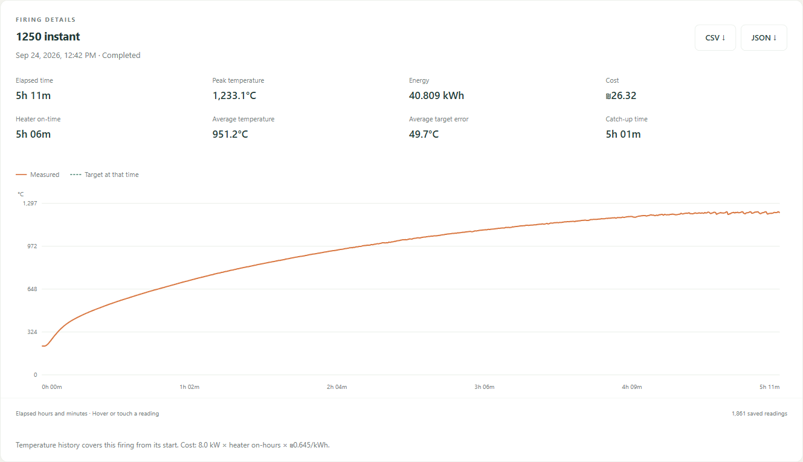

### Learn the kiln's heating capacity

History measures the fastest sustained three-minute rise at at least 90% heater duty within each 50°C band. It
excludes cooling, low-power holds, interrupted readings, and unsuitable samples. Measurements from matching
installed power feed the program editor's ramp warnings.

These are observed capabilities, not guaranteed limits: load, element condition, and supply voltage affect
performance. Ranges without qualifying measurements remain unknown. This feature guides program editing; it
does not automatically retune PID gains or rewrite schedules.

## Settings

The settings screen exposes **59 settings: 56 editable and 3 read-only legacy values**. Search across
categories, show technical names, and export a JSON copy. Service-enforced fields can also appear read-only.

1. Edit values in any category, then choose **Review & save** to inspect before/after
   values. Saving creates pending settings and leaves the running firing unchanged.
2. When the kiln is idle with no eligible recovery waiting, choose **Apply & restart**.
   The controller backs up the current settings, activates the saved values, and
   restarts through systemd. A directly launched process must be relaunched manually.
3. Use **Discard changes** to discard the local draft or review discarding pending
   settings. Concurrent-editor checks prevent silently overwriting another session.

Changing Celsius/Fahrenheit in the UI converts temperature limits, offsets, the PID window, and PID gains.
Programs are converted when loaded. Validation checks sensor selection, distinct GPIO pins, sampling
intervals, limits, and storage paths.

| Category | Fields | What it controls |
| --- | ---: | --- |
| Electricity & display | 6 | Installed power, tariff, currency, temperature/time/rate units |
| Firing behavior | 5 | Warm-start seek, catch-up, cycle length, low-temperature throttle |
| PID control | 4 | Kp, inverse Ki, Kd, control window |
| Sensor & wiring | 12 | Calibration, sampling, converter/type/filter, GPIO pins, polarity |
| Power-loss recovery | 3 | Enable recovery, maximum delay, clock synchronization |
| Protection overrides | 13 | Temperature limit and individual fault overrides |
| Server & storage | 5 | Port, logging level/format, recovery file, program directory |
| Simulation | 8 | Mode, ambient temperature, thermal model, speed multiplier |
| Compatibility | 3 | Unused cooling/airflow parameters and deprecated windup flag |

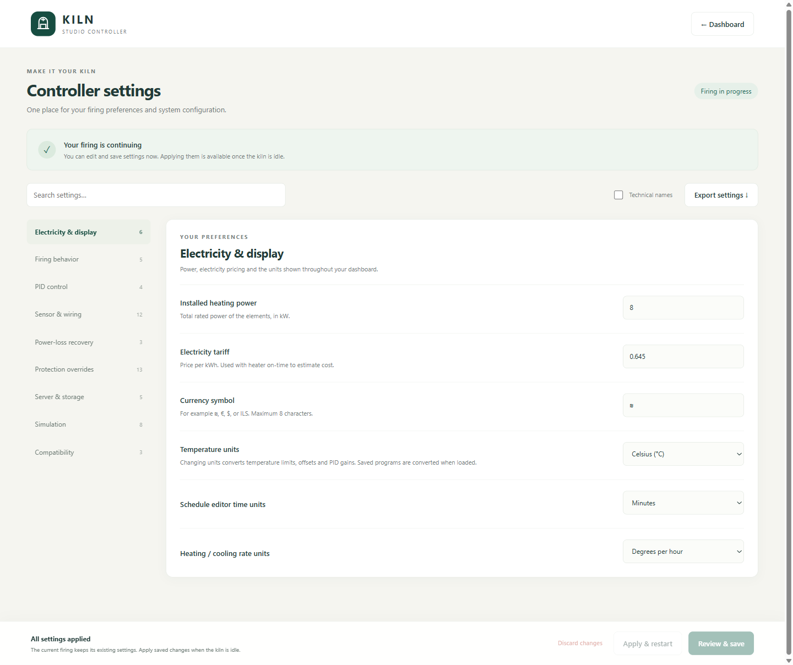

<details><summary>Firing behavior</summary>

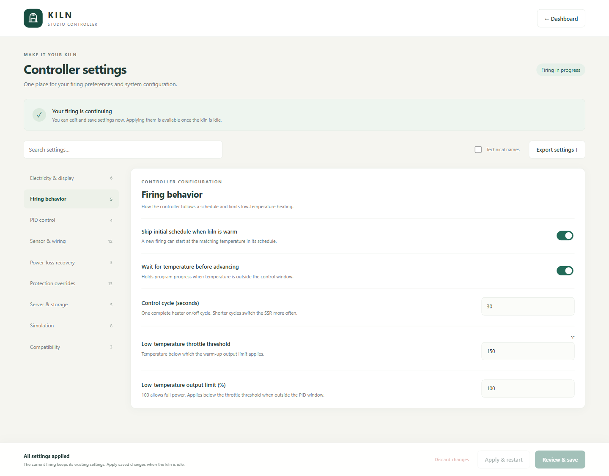

</details>

<details><summary>PID control</summary>

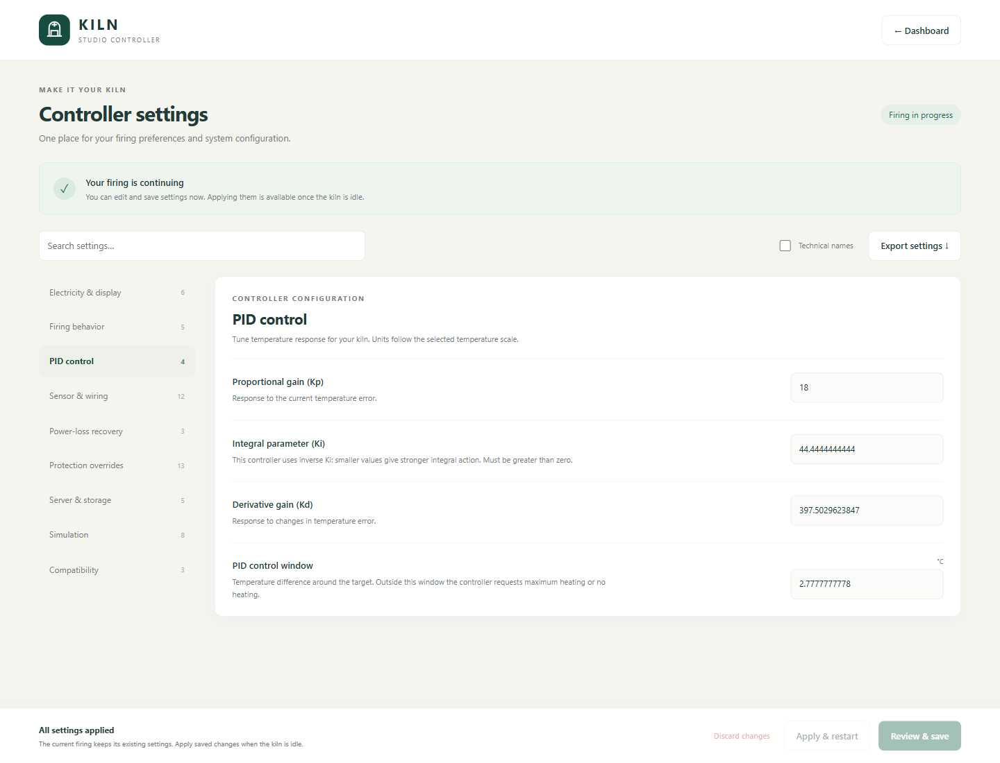

</details>

<details><summary>Sensor & wiring</summary>

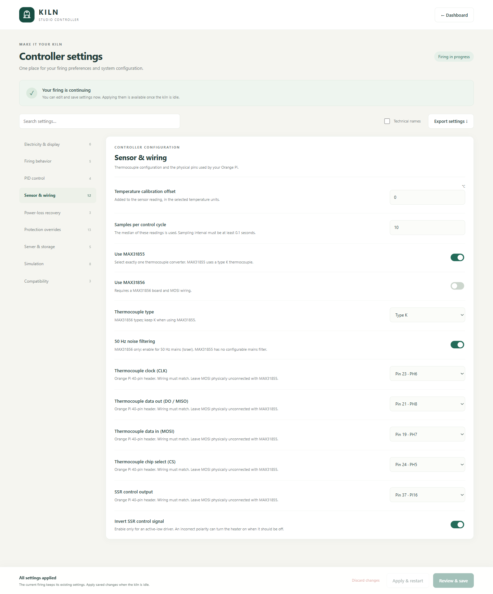

</details>

<details><summary>Power-loss recovery</summary>

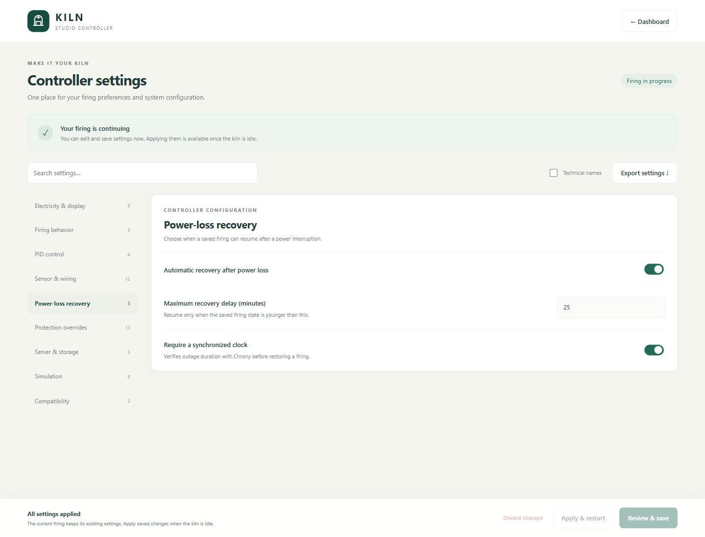

</details>

<details><summary>Protection overrides</summary>

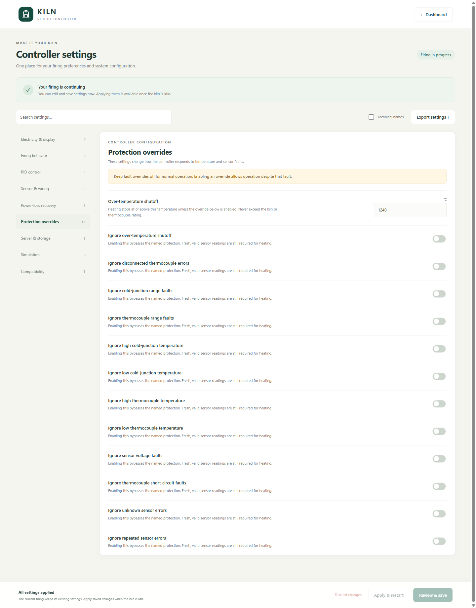

</details>

<details><summary>Server & storage</summary>

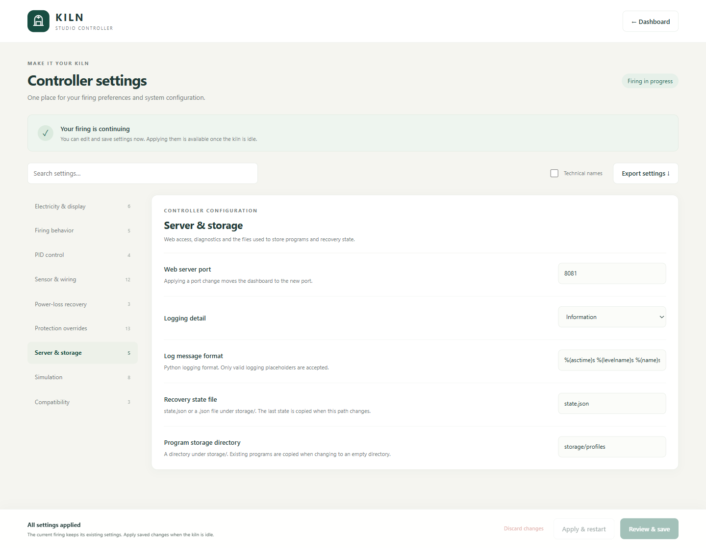

</details>

<details><summary>Simulation</summary>

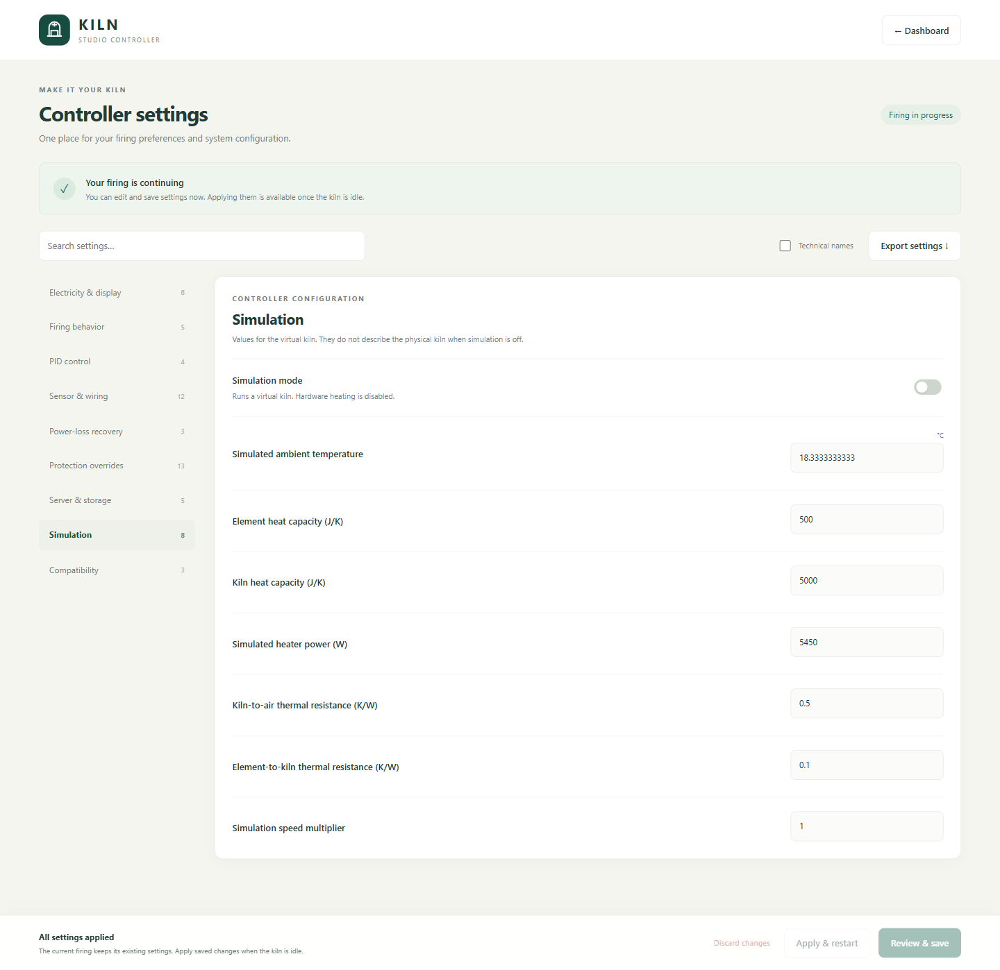

</details>

<details><summary>Compatibility</summary>

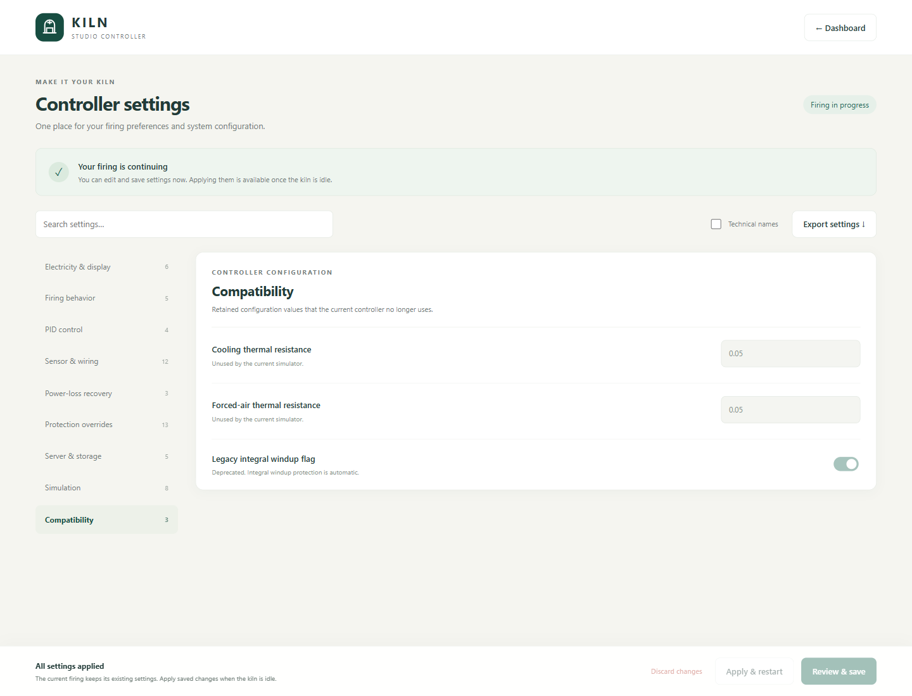

</details>

## Control and power-loss recovery

The controller supports MAX31855 with type K, or MAX31856 with B/E/J/K/N/R/S/T thermocouples. It uses median
sampling, requires fresh valid readings before heating, and supports over-temperature and sensor-fault
shutdown. Keep fault overrides disabled for normal operation. MAX31856's configurable 50 Hz filter does not
apply to MAX31855.

PID regulates heater duty inside its control window, with automatic integral windup protection outside that
window. Optional catch-up holds heating ramps when too cold, cooling ramps when too hot, and holds when
temperature is outside the window on either side. A ramp advances when temperature is already ahead of its
target; PID still controls heater output. Warm-start seek can skip initial schedule points when starting with
a warm kiln. Low-temperature throttling limits requested power
outside the PID window when the target is below its threshold.

Automatic recovery restores saved program progress after an eligible interruption. It requires a recent valid
**RUNNING** record, matching mode and units, valid schedule progress, a ready sensor, and synchronized Chrony
time when configured. Outage time does not advance the program or accrue energy. Paused, stopped, completed,
expired, corrupt, and mismatched records do not automatically resume.

**Stop firing** cancels recovery. Restarting the service during a firing preserves progress and may allow
recovery, so it is not equivalent to stopping the firing. The service and controller attempt to switch the
heat request off on exit; an uncaught controller-thread fault also stops output.

Simulation provides an adjustable thermal model and speed multiplier, without hardware heating. See the
installation guide for an isolated preview state/port. Its results are kept separate from real firings and are
not calibration evidence.

## API and diagnostics

| Interface | Purpose |
| --- | --- |
| `GET /api/health` | Current state, sensor readiness, energy, controller liveness |
| `GET /api/stats` | PID statistics |
| `POST /api` | `run`, `stop`, `pause`, `resume`, `memo`, or `stats` command |
| `GET /api/firings` | Firing records and aggregate statistics |
| `GET /api/firings/<id>` | Individual record and samples as JSON |
| `GET /api/firings/<id>?format=csv` | Individual samples as CSV |
| `POST /api/firings/clear` | Confirmed clearing of reviewed ended records |
| `GET /api/settings`, `POST /api/settings` | Read settings or save pending values |
| `POST /api/settings/discard`, `POST /api/settings/apply` | Discard pending values or apply/restart |
| WebSockets `/status`, `/config`, `/storage`, `/control` | Live updates, display configuration, program storage, legacy control |

The command API accepts JSON; `run` takes a saved `profile` name and optional `startat` in **minutes**. A
positive `startat` bypasses warm-start seek. API **pause maintains temperature and can continue heating**;
pause/resume are not dashboard buttons. Settings/history mutations require their current review token and
revision; those checks do not provide user authentication.

The [diagnostics view](public/state.html) plots temperature, error, duty, and PID terms and offers a CSV dump.
It loads its plotting/table libraries from cdnjs; the dashboard, history, and settings assets are served
locally.

Optional tools include [PID autotuning](docs/ziegler_tuning.md), [manual tuning notes](docs/pid_tuning.md),
the separately configured [Slack watcher](docs/watcher.md), and [OS-based scheduling with
`at`](docs/schedule.md). These are separate tools, not dashboard features. Review their scripts and dated
examples before use; sensor/output tests and autotuning can access real hardware.

## Data, backups, and updates

| Path | Contents |
| --- | --- |
| `config.py` | Tracked base configuration |
| `settings.json`, `settings.pending.json` | Applied local overrides and saved pending changes |
| `storage/settings-backups/` | Settings snapshot saved before each apply |
| `storage/profiles/` | Saved program JSON files, including explicit temperature units |
| `state.json` | Atomic recovery state and last firing totals when saved |
| `storage/firings/` | Real firing records, `samples.jsonl`, and per-firing summaries |
| `storage/simulated-firings/` | Separate simulated records and summaries |

These are default paths; Settings can relocate the recovery file and program directory. `KILN_SETTINGS_FILE`,
`KILN_STATE_FILE`, `KILN_PORT`, and `KILN_SIMULATE` provide service/preview overrides. Environment-selected
mode, port, and recovery path are locked in Settings.

Back up local settings, recovery state, and all of `storage/`; Git is not a backup of the installation's
runtime data. Firing samples are normally saved every ten seconds, with summaries refreshed periodically and
at important transitions. Perform updates only while idle, following the guide's [backup and update
procedure](docs/INSTALL.md#8-back-up-and-update).

Run the tests in the configured Linux environment with an isolated settings path,
so local deployment overrides do not change the expected test defaults:

```bash
kiln_test_dir="$(mktemp -d)"
KILN_SIMULATE=1 KILN_SETTINGS_FILE="$kiln_test_dir/settings.json" \
  venv/bin/python -m pytest -q Test
```

Tests cover program interpolation, recovery, energy accounting, staged settings, and firing history.
Imports require compatible GPIO dependencies; software tests do not verify wiring, calibration, or kiln tuning.

## Project history and license

This repository is based on [jbruce12000/kiln-controller](https://github.com/jbruce12000/kiln-controller),
which originated from [apollo-ng/picoReflow](https://github.com/apollo-ng/picoReflow). The original history
and attribution are retained alongside the Orange Pi support, new interface, persistent history, energy
accounting, and settings work.

Licensed under the **GNU General Public License, version 3 or later**; see [LICENSE](docs/LICENSE.md).
Provided without warranty. Historical [setup](docs/ORANGE-PI-SETUP.md) and [UI notes](docs/UI-UPDATE.md) describe
earlier deployments; use the current installation guide and applied settings for this version.
