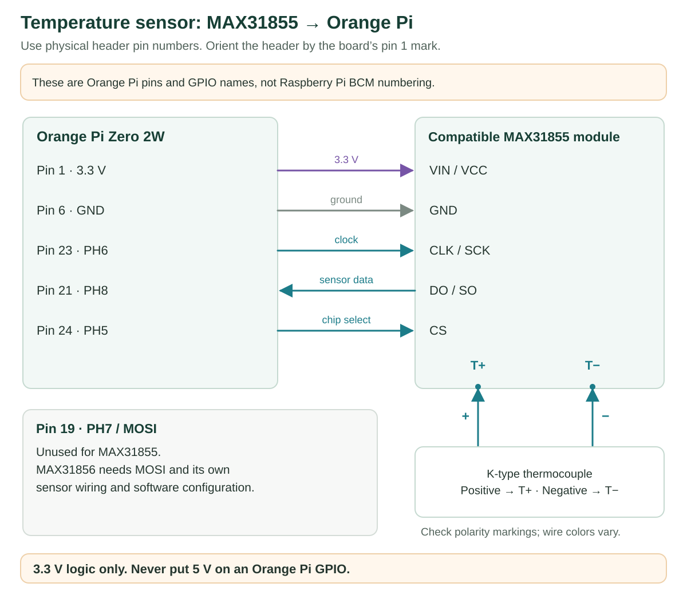
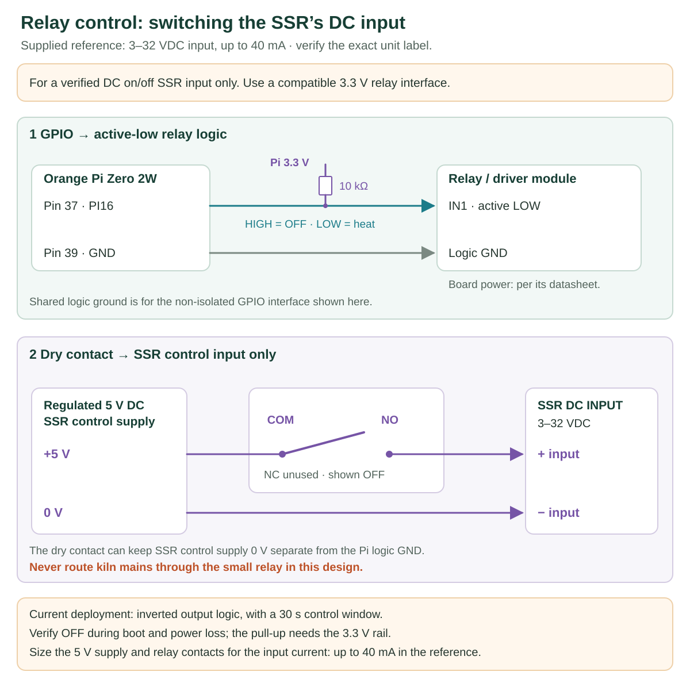
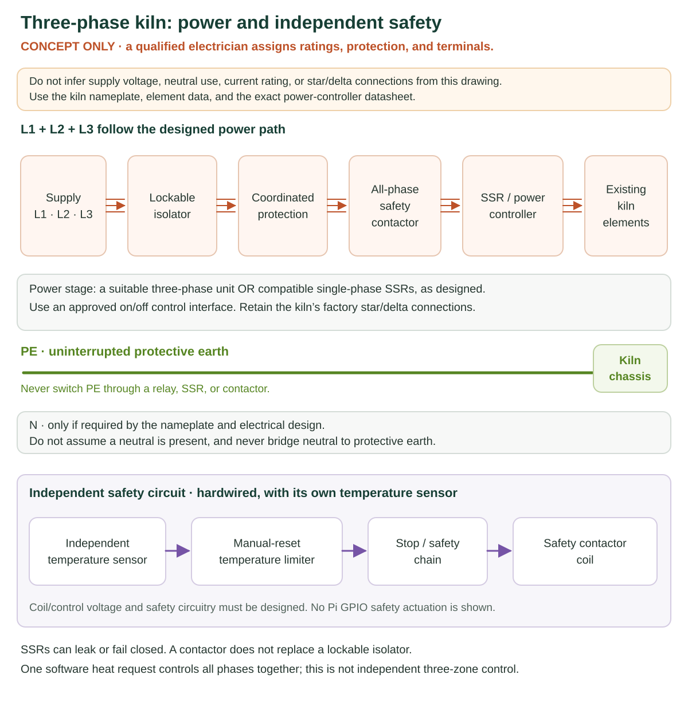

# Hardware installation, made simple

This guide connects the **Orange Pi Zero 2W**, a **MAX31855 + K-type thermocouple**,
and a **3–32 VDC-input SSR** to an electric kiln. The controller has **one heat
request**: a suitable three-phase power stage switches the kiln together. It does
not control three temperature zones independently.

**Have a qualified electrician wire and verify the kiln mains circuit.** The
three-phase drawing explains the arrangement; it does not specify cable sizes,
breakers, element links, or a certified safety circuit. Isolate, lock out, and
prove the mains dead before working. Software Stop and an SSR's OFF state are
not electrical isolation.

## 1. See the whole system

There are two jobs: the Orange Pi **asks for heat**, and the power equipment
**switches the kiln's electricity**. A separate temperature limiter must be able
to disconnect the kiln independently of the Orange Pi.

| Part | What it does | Choose/check |
| --- | --- | --- |
| Orange Pi Zero 2W | Runs the controller and web pages | Stable regulated 5 V power; keep outside the hot area |
| MAX31855 and K-type probe | Measure kiln temperature | Ungrounded probe, correct polarity, and a rating suitable for the kiln |
| GPIO-compatible relay/driver | Adapts the Pi's small 3.3 V signal | Input compatible with 3.3 V; correct active-low/high behavior |
| AC-output SSR power stage | Switches the heating elements | Correct phase arrangement, AC voltage, current, cooling, and protection |
| Independent high-limit controller + its own sensor | Stops excessive temperature without the Pi | Hardwired shutdown with manual reset |
| Safety contactor | Removes heater power when the safety circuit trips | All required live conductors; correct load and coil ratings |
| Isolator, protective devices, enclosure, and earth bonding | Provide isolation and electrical protection | Selected and installed for the actual kiln and local rules |

## 2. Power the controller

Use a good **regulated 5 V USB-C supply** for the Orange Pi. Its manufacturer
recommends 5 V / 2 A or 5 V / 3 A; 3 A gives more headroom for the board, subject
to the actual accessory load. Never use a voltage above 5 V.

| Circuit | Supply |
| --- | --- |
| Orange Pi | Regulated 5 V into its supported power connector |
| MAX31855 breakout | 3.3 V from physical pin 1, ground from pin 6 |
| Relay logic/coil | The relay module's specified supplies; see below |
| The illustrated SSR control input | Regulated 5 V, switched through relay contacts |
| Kiln elements | Their nameplate-rated mains supply, through the designed power circuit |

The Pi's **GPIO pins use 3.3 V logic**. A 5 V power pin is not a 5 V GPIO signal.
Do not apply 5 V, 12 V, or 24 V to a GPIO pin. Do not connect two independent
5 V supplies together through the USB and header power connections.

For the non-isolated GPIO interface shown here, Pi ground and the driver input's
logic ground share a reference. A relay's dry contacts can switch a separate
SSR control supply; do not assume that every supply ground must be joined.
Neither DC ground nor neutral is a substitute for protective earth.

**About VCC / JD-VCC:** the earlier relay module used 3.3 V on VCC, 5 V on
JD-VCC, and a removed jumper. That arrangement is specific to that module.
Removing a jumper does not prove 3.3 V compatibility or isolation. Check the
module diagram before copying the [historical connections](RELAY-MODULE-CHANGE.md).

## 3. Connect the temperature sensor

These are **physical pin numbers on the Orange Pi's 40-pin header**, not
Raspberry Pi BCM numbers. Find pin 1 from the board marking/manual before
connecting anything. Work with power disconnected.

| Orange Pi physical pin | Signal | MAX31855 connection |
| --- | --- | --- |
| 1 | 3.3 V | Compatible VIN / VCC supply input |
| 6 | Ground | GND |
| 23 | PH6 / GPIO 230 | CLK / SCK |
| 21 | PH8 / GPIO 232 | DO / SO / MISO |
| 24 | PH5 / GPIO 229 | CS |
| 19 | PH7 / MOSI | Leave disconnected for MAX31855 |

Connect the thermocouple to the converter's **T+ and T−** markings. Match the
probe, extension cable, and connector to type K; wire colors differ between
standards. Use an **ungrounded, electrically insulated probe** with MAX31855.
Keep the probe insulated from live elements, the converter outside the hot
chamber, and sensor cables away from mains and relay wiring.

On Adafruit breakouts, **3Vo is an output**, not VIN. Other modules can have
different power arrangements: use the module's actual supply labels.

**Using MAX31856 instead:** also connect pin 19 / PH7 to SDI / MOSI, select
MAX31856 in Settings, and choose the actual thermocouple type. Use 3.3 V logic.
Its 50 Hz filter setting does not apply to MAX31855.

## 4. Connect the relay and SSR input

The supplied product reference shows **two different input versions**. The
owner identified the **3–32 VDC version on the left**. The 70–280 VAC version
on the right is not the control circuit used in this guide.

Supplied SSR reference image and ratings

The reference lists 3–32 VDC input, **40 mA maximum input current**, 24–480 VAC
output, an 80 A load-current label, up to 5 mA off-state leakage, and up to
1.5 V on-state voltage drop. These are the supplied reference's claims, not an
independent verification of the installed unit or its certification. Check its
actual label and full datasheet, including the heatsink/temperature derating.

Use the relay/driver rather than powering this input directly from GPIO:
**up to 40 mA is not a load to assume the Pi pin can drive**. A regulated 5 V
control supply is within the stated 3–32 VDC input range.

For the documented **active-low, 3.3 V-compatible relay interface**:

| From | To |
| --- | --- |
| Pi pin 37 / PI16 | Relay IN1 |
| Pi pin 39 / ground | Relay input logic ground |
| Pi pin 17 / 3.3 V, through 10 kΩ resistor | Relay IN1, as an OFF-bias pull-up |
| Regulated control supply +5 V | Relay COM |
| Relay NO (normally open) | SSR control input + |
| Control supply 0 V | SSR control input − |
| Relay NC (normally closed) | Leave unused |

Power the relay module itself according to its datasheet. The **COM → NO
contacts switch only the SSR's low-voltage control input**, not the kiln mains.
The SSR's AC load terminals are a separate circuit.

In **Settings → Sensor & wiring**, enable **Invert SSR control signal** for
this active-low module: HIGH = no heat request, LOW = heat request. The
documented mechanical relay uses a **30-second control cycle** in Firing
behavior to reduce cycling. A different driver can require different settings.

The 10 kΩ pull-up biases the input off **only while its 3.3 V rail exists**.
It does not guarantee OFF if the Pi loses power while another supply remains
on. Verify OFF during boot, shutdown, and controller power loss with kiln mains
isolated; the independent safety circuit remains necessary.

The product title alone does not identify every variant. A module labeled
0–10 V, 4–20 mA, or potentiometer input needs a different interface: this
software currently provides on/off time-proportional heat requests, not an
analog voltage-regulator command.

## 5. Understand the three-phase power path

**Conceptual arrangement for the electrician — not terminal-by-terminal
installation instructions.** The kiln supply voltage, element connections,
neutral requirements, and protective-device ratings have not been supplied.

- **L1, L2, L3** are the three phase conductors. Use a suitable three-phase SSR
  assembly, or an engineered arrangement of separate AC SSRs receiving the same
  heat request. One ordinary single-phase SSR does not control three phases.
- The illustrated SSR has power-channel pairs **A1/A2, B1/B2, C1/C2**. These
  are not the small **+ / − DC control input**. Verify the actual unit's diagram
  before assigning incoming and outgoing conductors.
- **PE (protective earth)** stays continuous to the kiln frame and exposed
  enclosure metal. Never route it through an SSR, switch, or fuse.
- **N (neutral)** is connected only where the original kiln and supply design
  require it. A star point is not automatically a neutral. Never use PE as N.
- Preserve the kiln manufacturer's **star/delta element connections**. Do not
  change element links to suit this generic drawing.
- Keep the original interlocks and a separate high-limit sensor/controller.
  Their designed hardwired circuit must drop out the safety contactor without
  depending on the Pi. The contactor is for shutdown; the SSR performs normal
  heating modulation. Its coil is not driven directly by GPIO.

### What the 80 A label means for selection

It does not mean the module can continuously carry 80 A in any enclosure.
Select it using the manufacturer's per-channel load ratings, supply voltage,
ambient-temperature derating, heatsink, mounting method, and coordinated
protection. Fit the specified heatsink and thermal interface. Do not parallel
SSR outputs to increase their current rating. For ordinary resistive heaters,
a suitable zero-cross AC SSR is usually appropriate; verify the actual model
and heater requirements rather than inferring this from the product title.

**Example only:** an 8 kW balanced resistive load on 400 V three-phase draws
approximately `8000 / (√3 × 400) = 11.5 A` per line at unity power factor.
That is not a measurement or nameplate rating for this kiln, and it does not
select a breaker, cable, contactor, or heatsink. The app's **Installed heating
power** is the total kW used for cost estimates; it does not set electrical
power or prove the kiln rating.

An SSR can leak current when OFF and can fail closed. Its indicator LED shows
the control signal, not proof that heater power is absent. Use the independent
shutdown circuit, and use the lockable isolator for maintenance.

## 6. Check in this order

1. **With power isolated:** check pin numbers, connector labels, protective
   earth, enclosure separation, strain relief, and the electrician's mains design.
2. **Control power only, kiln mains isolated:** verify the 5 V and 3.3 V rails,
   correct relay polarity, and no SSR heat request at idle, boot, or Pi power loss.
3. **Sensor:** confirm a plausible room-temperature reading and a rising reading
   when the probe is warmed. Resolve sensor faults before enabling heat.
4. **Software:** follow the [installation guide](INSTALL.md), preview in simulation,
   and review Sensor & wiring, Firing behavior, Protection overrides, and the
   actual power/tariff. Keep fault overrides off.
5. **Independent shutdown:** have the electrician verify over-temperature and
   limiter-sensor-fault trips, safe contactor dropout on loss of safety-control
   power, manual reset after a limit trip, the stop/interlock chain, and isolation.
6. **First real heat:** only after commissioning, make a supervised low-temperature
   test appropriate to the kiln and load. Confirm heating stops on command and
   inspect the SSR's operating temperature against its rated cooling design.

Do not run the output-toggle script as a routine check on a powered kiln.
Changing settings or passing software tests does not verify physical wiring.

## Reference documents

- [Orange Pi Zero 2W manual: power and 40-pin header](http://www.orangepi.org/orangepiwiki/index.php/Orange_Pi_Zero_2W#40_Pin_Interface_pin_description)
- [Adafruit MAX31855 guide](https://learn.adafruit.com/thermocouple?view=all)
- [Adafruit MAX31856 guide](https://learn.adafruit.com/adafruit-max31856-thermocouple-amplifier?view=all)
- [Omron SSR precautions: protection, leakage, and heat dissipation (PDF)](https://omronfs.omron.com/en_US/ecb/products/pdf/precautions_ssr.pdf)

These references explain the board/sensor connections and general SSR practice.
The Omron document is not a datasheet for the supplied EARU/LCTC product.
